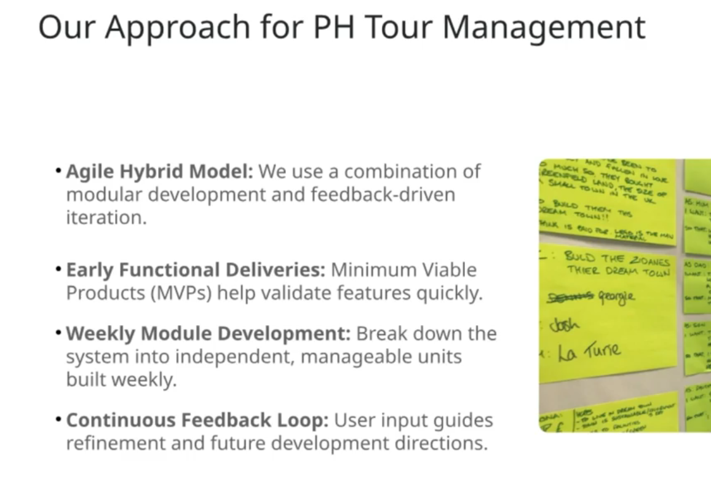

# Be-A-Industry-Standard-Maestro

Requirement Analysis - PH Tour Management System Backend

https://docs.google.com/document/d/1XRN18ClObPMJGKl7CfZFBLeZuJf2h8JOBc_crzuWtT4/edit?tab=t.0


Workflow of the PH Tour Management System 

https://gitmind.com/app/docs/mzkbj5o2


PH Tour Management System Data Modelling

https://docs.google.com/document/d/1NSELQ7_jUx4xLGchef4HT3_9YqDWrdzUUGMZWmD2lY0/edit?tab=t.0


ER Diagram for PH Tour Management System

https://drive.google.com/file/d/1ASphx7B6gHIKPiiiNf3AB_ZTvdYRBsQz/view?usp=sharing


PNG Format of ER Diagram for PH Tour Management System

https://drive.google.com/file/d/1KspyCQ992oAw1dDhIzRtK8-q5jnhWG0z/view?usp=drive_link


PH Tour Management System API Endpoints

https://docs.google.com/document/d/1HysoioRCpSsGpSz8JQZRGii9GNkpdx0pEX-zHP2p334/edit?tab=t.0


GitHub Repository

https://github.com/Apollo-Level2-Web-Dev/ph-tour-management-system-backend


Project Setup Branch

https://github.com/Apollo-Level2-Web-Dev/ph-tour-management-system-backend/tree/project-setup


Development Branch

https://github.com/Apollo-Level2-Web-Dev/ph-tour-management-system-backend/tree/development

## 25-1 What is SDLC, How we should start a Project

#### What is SDLC? 


- This means we will divide each and every works of a project 

- SDLC Increases project's maintainability, predictability and makes cost efficient.  


- Different models of sdlc 


1. **Waterfall :** Its like after all formalities end user will get the final project. From planning to deployment all are done in between. 
2. **Agile :** This is built based on mvp pattern. This means the necessary components or features are built and given to client then gradually approaching
3. **Spiral :** This works in agile style and all the risk factors are considered so that less improvements are required 
4. **V-Model :** This works in waterfall modal and it undergoes heavy testing so that less improvements are required 

#### What Model We Will Follow? 

- We will use agile hybrid model and whe will create MVP. 

#### Different Phases Of SDLC 


##### Phase-1 : Planning Phase 


##### Phase-2 : Requirement Analysis


##### Phase-3 : System Design 


##### Phase-4 : Development


##### Phase-5 : Testing Phase 


##### Phase-6 : Deployment 


##### Phase-7 : Maintenance  


#### How We Will Work?


## 25-2 Requirement Analysis of PH Tour Management System

[REQUIREMENT ANALYSIS OF PH TOUR](https://docs.google.com/document/d/18-PxR_7rhUsh1oyNc1TZ39aY837bxvzoz7XW-xn2ehk/edit?usp=sharing)


## 25-3 Workflow of PH Tour Management System

[Workflow](https://gitmind.com/app/docs/m0k204te)


## 25-4 Modelling Data for PH Tour Management System

[DATA-MODELING-PH-TOUR](https://docs.google.com/document/d/17LyBRqUM2FAgLNUzTpR6Ecq3clLwsoFhUQNLVBWpqDI/edit?usp=sharing)

## 25-5 How to Make ER Diagram for PH Tour Management System


[ERD](https://drive.google.com/file/d/1-63IaqNgZJfUDU34sk3IHX__raqn8CD1/view?usp=sharing)


## 25-6 Create API Endpoints for PH Tour Management System

[API ENDPOINTS](https://docs.google.com/document/d/1B_Qc6ocEB5eF7iAidmET1BxGwsdGdfVaP2raLGepYaY/edit?usp=sharing)

## 25-7 Setting Up Project with Required Dependencies

- Initialize Git 

```bash
git init 
```
- Create a development branch 

```bash 
git checkout -b development  
```
- Initialize Npm

```bash 
npm init -y
```

- Install Typescript

```bash 
npm i -D typescript
```
- Initialize Typescript 

```bash 
tsc --init
```

- Set RootDir and OutDir inside tsconfig.json 

```bash 
  "rootDir": "./src",
   "outDir": "./dist",
```

- Install the main dependencies 

```bash 
npm i express mongoose cors zod dotenv jsonwebtoken

```

- Install all the type declarations and dev dependencies 

```bash 
npm i -D ts-node-dev @types/express @types/cors @types/dotenv @types/jsonwebtoken

```

## 25-8 Software Design Patterns, MVC vs Modular Pattern
- In MVC pattern This happens like View -> Controller -> Model -> Then model communicates with database -> sends response to view through controller 
- For large scale project MVC pattern will make hassle so we will go for modular mvc  pattern which will divide the features in different segments

## 25-9 Setting Up Server and App

- Create server.ts

```ts 
import { Server } from "http"

import mongoose from "mongoose"
import app from "./app";

let server: Server


const startServer = async () => {
    try {
        await mongoose.connect("")
        server = app.listen(5000, () => {
            console.log("Server is Running On Port 5000")
        })
    } catch (error) {
        console.log(error)
    }
}

startServer()

```
- Create app.ts file 

```ts 

import express, { Request, Response } from "express"

const app = express()


app.get("/", (req: Request, res: Response) => {
    res.status(200).json({
        message: "Welcome To Tour Management System"
    })
})

export default app
```

- add script to run the project 

```json
  "scripts": {
    "dev" : "ts-node-dev --respawn --transpile-only ./src/server.ts",
    "test": "echo \"Error: no test specified\" && exit 1"
  },
```

## 25-10 Error Handlers for Server, UnhandledRejection, UncaughtException

- There are three types of server error
  1. **UnhandledRejection** : Resamples promise rejection Error. If We miss any using try catch, it will be caught in here. It will gradually shut down the server and prevents to shut down instantly (crash)
  2. **UncaughtException** : It Like we have console logged a variable that we have never declared. This will give us error if we do not handle with try catch it will be handled by uncaughtException. that error that is not related to promise and and has not been handled using try catch. 
  3. **Signal Termination/ Sig Term** : When project is deployed in cloud platform like aws vercel or any, If the scenario is like the platform sends signal to kill the server for maintenance purpose we will gracefully shut down the server and this is called signal termination. 

- server.ts
```ts 
import { Server } from "http"

import mongoose from "mongoose"
import app from "./app";

let server: Server


const startServer = async () => {
    try {
        await mongoose.connect("");
        console.log("Connected To MongoDb")
        server = app.listen(5000, () => {
            console.log("Server is Running On Port 5000")
        })
    } catch (error) {
        console.log(error)
    }
}

startServer()

process.on("SIGTERM", (err) => {
    console.log("Signal Termination Happened...! Server Is Shutting Down !", err)
    if (server) {
        server.close(() => {
            process.exit(1)
        })
    }

    process.exit(1)

})

process.on("SIGINT", () => {
    console.log("I am manually Closing the server! Server Is Shutting Down !")

    // if express server is on and unhandled rejection happens close the express server using server.close()
    // then close the node server using process.exit(1)
    if (server) {
        server.close(() => {
            process.exit(1)
        })
    }

    process.exit(1)

})
process.on("unhandledRejection", () => {
    console.log("Unhandled Rejection Happened...! Server Is Shutting Down !")

    // if express server is on and unhandled rejection happens close the express server using server.close()
    // then close the node server using process.exit(1)
    if (server) {
        server.close(() => {
            process.exit(1)
        })
    }

    process.exit(1)

})

process.on("uncaughtException", (err) => {
    console.log("Uncaught Exception Happened...! Server Is Shutting Down !", err)

    // if express server is on and unhandled rejection happens close the express server using server.close()
    // then close the node server using process.exit(1)
    if (server) {
        server.close(() => {
            process.exit(1)
        })
    }

    process.exit(1)

})

//  test unhandled rejection

// Promise.reject(new Error("Opps! Unhandled Rejection Happened !....Forgot To Catch error ! "))


// TESTING uncaughtException
// throw new Error("Maamah I'm Uncaught exception error ")


```

## 25-11 Setting Up ES Lint and Fix Errors Using Commands

[Typescript Eslint Setup](https://typescript-eslint.io/getting-started)


- Install Eslint 

```bash 
npm install --save-dev eslint @eslint/js typescript typescript-eslint
```

- Configure the eslint inside eslint.config.mjs

```mjs
// @ts-check

import eslint from '@eslint/js';
import tseslint from 'typescript-eslint';

export default tseslint.config(
    eslint.configs.recommended,
    tseslint.configs.recommended,
);

```
- Comment the `tseslint.configs.recommended,`  and add this two instead

```mjs 
    tseslint.configs.stylistic,
    tseslint.configs.strict,

```

- Set The Rules 

```mjs
// @ts-check

import eslint from '@eslint/js';
import tseslint from 'typescript-eslint';

export default tseslint.config(
    eslint.configs.recommended,
    // tseslint.configs.recommended,
    tseslint.configs.stylistic,
    tseslint.configs.strict,
    {
        rules: {
            "no-console": "warn"
        }
    }

);
```

- For checking deployment 

```bash 
npx eslint .

```

- For lint checking only the sec folder 

```bash 
npx eslint ./src
```

- Lets make a script for this in package.json file 

```json

  "scripts": {
    "dev": "ts-node-dev --respawn --transpile-only ./src/server.ts",
    "lint" : "npx eslint ./src",
    "test": "echo \"Error: no test specified\" && exit 1"
  },
```

## 25-12 Setting Up Environment Variables

- src -> app -> env.ts

```ts 
import dotenv from "dotenv"

dotenv.config()

interface EnvConfig {
    PORT: string
    DB_URL: string,
    NODE_ENV: "development" | "production"
}

const loadEnvVariables = (): EnvConfig => {
    const requiredEnvVariables: string[] = ["PORT", "DB_URL", "NODE_ENV"];

    requiredEnvVariables.forEach(key => {
        if (!process.env[key]) {
            throw new Error(`Missing required environment variable ${key}`);
        }
    });

    return {
        PORT: process.env.PORT as string,
        // eslint-disable-next-line @typescript-eslint/no-non-null-assertion
        DB_URL: process.env.DB_URL!,
        NODE_ENV: process.env.NODE_ENV as "development" | "production",
    };
};


export const envVars = loadEnvVariables()


```

- server.ts 

```ts
/* eslint-disable no-console */
import { Server } from "http"

import mongoose from "mongoose"
import app from "./app";
import { envVars } from "./app/config/env";

let server: Server


const startServer = async () => {
    try {
        await mongoose.connect(envVars.DB_URL);
        console.log("Connected To MongoDb")
        server = app.listen(envVars.PORT, () => {
            console.log(`Server is Running On Port ${envVars.PORT}`)
        })
    } catch (error) {
        console.log(error)
    }
}

startServer()

process.on("SIGTERM", (err) => {
    console.log("Signal Termination Happened...! Server Is Shutting Down !", err)
    if (server) {
        server.close(() => {
            process.exit(1)
        })
    }

    process.exit(1)

})

process.on("SIGINT", () => {
    console.log("I am manually Closing the server! Server Is Shutting Down !")

    // if express server is on and unhandled rejection happens close the express server using server.close()
    // then close the node server using process.exit(1)
    if (server) {
        server.close(() => {
            process.exit(1)
        })
    }

    process.exit(1)

})
process.on("unhandledRejection", () => {

    console.log("Unhandled Rejection Happened...! Server Is Shutting Down !")

    // if express server is on and unhandled rejection happens close the express server using server.close()
    // then close the node server using process.exit(1)
    if (server) {
        server.close(() => {
            process.exit(1)
        })
    }

    process.exit(1)

})

process.on("uncaughtException", (err) => {
    console.log("Uncaught Exception Happened...! Server Is Shutting Down !", err)

    // if express server is on and unhandled rejection happens close the express server using server.close()
    // then close the node server using process.exit(1)
    if (server) {
        server.close(() => {
            process.exit(1)
        })
    }

    process.exit(1)

})

//  test unhandled rejection

// Promise.reject(new Error("Opps! Unhandled Rejection Happened !....Forgot To Catch error ! "))


// TESTING uncaughtException
// throw new Error("Maamah I'm Uncaught exception error ")

```